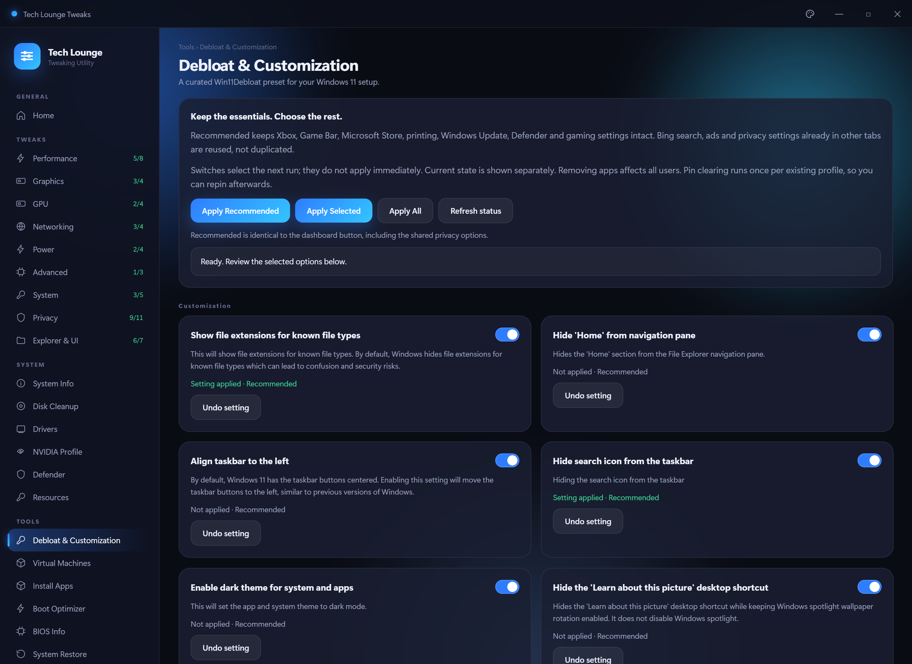
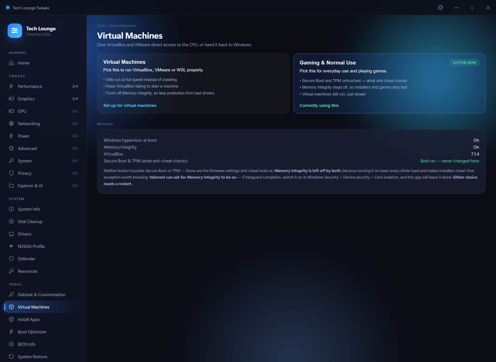
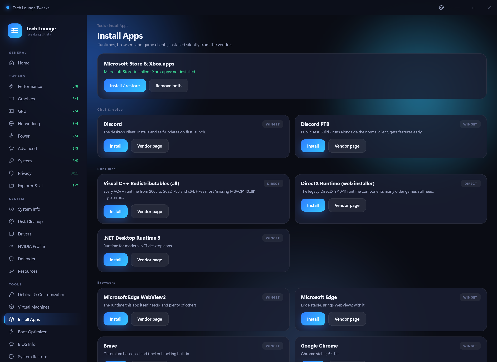

# Tech Lounge Tweaks

A Windows 11 tweaking utility built for The Tech Lounge. Toggle performance,
latency and privacy tweaks, apply a tuned NVIDIA driver profile in one tap,
turn Defender on or off, install runtimes, browsers and game clients silently,
test your connection for bufferbloat, clean up junk files and check your GPU
drivers — all from one window.

Every page reads the **live** system state, so the app shows what is actually
set on your machine rather than assuming. The dashboard has a curated recommended
preset, and individual pages explain the scope and undo options for their changes.


---

## Download

**[⬇ Download TechLoungeTweaks.zip](https://github.com/RaheemC4/tech-tips/raw/main/TechLoungeTweaks/TechLoungeTweaks.zip)**

1. Download the zip
2. **Extract it** somewhere you keep programs — `C:\Tools\` is a good spot.
   Do not run it from inside the zip, and avoid leaving it in Downloads
   (Windows cleans that folder out and scans it hard)
3. Open the extracted folder and run **TechLoungeTweaks.exe**

Keep the whole folder together. What you will see inside it:

```
TechLoungeTweaks\
├─ TechLoungeTweaks.exe     ← run this
├─ TL-api.log               ← plain-text log, for troubleshooting
├─ _internal\               ← the app itself, leave it alone
└─ resources\               ← NVIDIA Profile Inspector + the .nip profile
```

Only the exe and the log sit at the top level, so there is nothing to click on
by mistake. Moving the exe out on its own will not work.

### Why a folder and not one .exe

An earlier version was a single self-extracting exe. It unpacked ~46 MB to
your temp folder on *every* launch, which made startup slow and unpredictable,
and the self-extracting behaviour is exactly what antivirus heuristics look
for — Defender was flagging it as a false positive. The folder build starts
almost instantly and does not trip those scanners.

### First run

Windows will show a blue **"Windows protected your PC"** box, because the app
is not code-signed (a signing certificate costs a few hundred pounds a year,
which is not worth it for a free tool).

> Click **More info** → **Run anyway**

If your browser blocks the download itself with **"Virus detected"**, that is
the same false positive — use *Downloads → Keep* in the browser, or extract
with 7-Zip, which avoids Windows tagging the extracted files as
web-downloaded.

#### "Smart App Control blocked an app that may be unsafe"

This is a **different** dialog — it only has **Okay** and **Get apps from the
Store**, with no way to run the app anyway. That is Smart App Control, not
SmartScreen, and it blocks every unsigned program with no per-app override.

Only clean Windows 11 installs have it switched on. To check:

> Windows Security → App & browser control → Smart App Control

If it says **On**, the only ways round it are to turn it off or not run the app.

⚠️ **Turning Smart App Control off is permanent.** Microsoft does not allow it
to be switched back on afterwards — the only way to re-enable it is a clean
reinstall of Windows. Do not turn it off casually, and never on someone else's
machine without telling them that first.

If it says **Evaluation** or **Off**, this dialog is not what is stopping you —
see the SmartScreen steps above.

**It needs to run as administrator** and will prompt for that automatically,
because most of these settings live in `HKEY_LOCAL_MACHINE`.

### Requirements

| | |
|---|---|
| **Windows 11** | Works out of the box |
| **Windows 10** | Needs the [WebView2 runtime](https://developer.microsoft.com/microsoft-edge/webview2/) (free, from Microsoft) — the app checks on launch and links you to it if it is missing |
| **NVIDIA GPU** | Only needed for the NVIDIA Profile page; everything else works on any machine |
| **App Installer / winget** | Optional. Install Apps prefers it, and falls back to direct vendor downloads when a debloated image has removed it |

---

## Before you start

**Make a restore point.** There is a button for it under *Tools → System
Restore*. It takes about ten seconds and means any change here is reversible
even if something goes wrong.

Two tweaks will break games with kernel-level anti-cheat. They are marked
with a yellow warning in the app, but to be explicit:

- **Disable Memory Integrity** — Valorant (Vanguard) and FACEIT will refuse
  to launch.
- **Disable CPU Mitigations** — weakens Spectre/Meltdown protection.

Read each option before applying it. App removal and clearing Start pins are
not reversed by the dashboard's Revert All button.

---

## What's in it

### Tweaks


Around 50 tweaks across nine categories. Each one shows whether it is
currently applied, and the toggle works both ways.

| Category | What it covers |
|---|---|
| **Performance** | GameDVR, Game Mode, fullscreen optimizations, power throttling, Ultimate Performance plan, CPU priority |
| **Graphics** | Hardware GPU scheduling, variable refresh rate, windowed optimizations, mouse acceleration |
| **GPU** | NVIDIA and AMD driver-level tweaks — only the ones for your card are shown |
| **Networking** | Nagle's algorithm, network throttling, offloads, firewall popups |
| **Power** | Dynamic tick, timer coalescing, USB selective suspend and power management |
| **Advanced** | Memory compression, page combining, CPU mitigations |
| **System** | Sticky/Filter/Toggle keys (the Shift x5 pop-up), shutdown speed, menu delay, startup delay, SysMain, telemetry service |
| **Privacy** | Telemetry, activity history, advertising ID, error reporting, typing/speech/ink collection |
| **Explorer & UI** | Classic context menu, Bing in Start, snap layouts, lock screen, widgets, ads |

### One-click setup

Four buttons on the dashboard, for when you do not want to work through nine
categories by hand:

| Button | What it does |
|---|---|
| **Apply Recommended** | Curated privacy settings, optional bundled-app removal and the customization choices listed below. Leaves gaming tweaks, Xbox, Game Bar, NVIDIA settings, Defender and virtualization alone. |
| **Apply All** | Asks for confirmation, then applies the legacy tweaks (including risky ones), NVIDIA profile, Defender off and the curated Debloat & Customization options. |
| **Revert All** | Restores the legacy tweaks from the app's saved original values. Does not reinstall removed apps or restore Start pins. |
| **Windows Defaults** | Turns legacy tweaks off, restores NVIDIA settings and enables Defender. Does not undo the new debloat actions. |

Apply All checks for an NVIDIA GPU before applying its driver profile. Recommended
uses the same preset from the dashboard and the Debloat & Customization page.

### Debloat & Customization



This page integrates selected helpers and settings from
[Win11Debloat](https://github.com/Raphire/Win11Debloat). It does not run the
upstream default preset. Existing options such as Bing search remain in their
original tabs instead of appearing twice.

**Apply Recommended** selects these customization changes: show file extensions
and hidden files, hide Home from Explorer navigation, align the taskbar left,
hide the taskbar search icon, show clock seconds, enable dark theme, hide
"Learn about this picture", clear existing Start pins once, use the Start All
Apps list, hide Start recommendations, disable Bing and Copilot in search, hide
Task View and enable the taskbar End Task option.

It also applies selected privacy and advertising settings and disables Copilot,
Recall, Click to Do and AI additions in Paint, Notepad and Edge. The optional
packaged apps selected for removal are Clipchamp, Cortana, Bing Finance, News,
Sports and Weather, Get Started, the Microsoft 365 promotional hub, Mixed Reality
Portal, Skype and the packaged Copilot app. Missing apps are already satisfied.
Xbox, Game Bar, Gaming Services, Microsoft Store, printing and Windows framework
packages are excluded. Gaming settings are not changed by Recommended.

The switches select what the next **Apply selected** action will do; the status
beside each option reports its detected state. **Apply all** asks for confirmation.
Hide Gallery and hide duplicate drives are optional and off in Recommended.
Unavailable options show their minimum Windows build and are skipped. Some Start
policies depend on edition and feature rollout: a stored policy does not guarantee
that every Windows build will change its appearance. Sign out or restart manually
if Windows has not refreshed the interface.

**Clearing Start pins is a one-time action per existing user profile** with a
Start layout file. It does not lock the layout or change the default profile;
users can pin apps again. Successfully processed profiles are recorded so later
runs preserve newly added pins. The upstream helper backs up the old layout beside
the profile's `start2.bin` file.

Registry changes have individual **Undo** actions using upstream undo settings.
Registry backups and the last run log are kept under
`%LOCALAPPDATA%\TechLoungeTweaks\Debloat`. Undo is not offered for removed apps or
cleared pins; reinstall wanted apps through Microsoft Store and repin them yourself.

### NVIDIA Profile


One toggle applies a tuned set of global NVIDIA driver settings — the same
profile for everyone, so there is no "what did you set yours to" in chat.

**NVIDIA Profile Inspector (Revamped) ships inside the zip**, in the
`resources` folder. Nothing to download.

The table lists every setting the profile touches: what your driver holds
**right now** on the left, what it becomes on the right, with the changed ones
struck through. Highlights include Power Management on *Prefer maximum
performance*, Low Latency Mode *Ultra*, Preferred Refresh Rate *Highest
available*, and G-SYNC on for fullscreen **and** windowed.

**How reverting works.** The first time you open the app on a PC with an
NVIDIA card, it quietly exports that PC's current NVIDIA settings once and
keeps the file in `%LOCALAPPDATA%\TechLoungeTweaks`. Turning the profile off
restores *your* original settings, not a generic default. That backup is taken
once per machine, is never overwritten, and is never shared.

**It re-checks itself every launch.** The app reads your live driver settings
in the background at startup rather than trusting its own record, so anything
you changed in the NVIDIA Control Panel, in Profile Inspector directly, or
that a driver reinstall reset shows up correctly. If only part of the profile
is live you get *"Partly applied — 7 of 39 settings match"* rather than a
toggle that quietly lies. The read is warmed on startup, so the page is
already filled in by the time you click the tab.

Only NVIDIA driver settings are touched — nothing else on the PC.

**On a machine without an NVIDIA card** the page seals itself and names the GPU
it actually found, so nobody applies a driver profile that cannot do anything.
Every other tab keeps working normally.


### Windows Defender


One toggle for the whole of Microsoft Defender, with the live state of each
component listed underneath.

**Tamper Protection.** Since Windows 10 1903, Windows blocks *every* app —
this one included — from switching real-time protection off while Tamper
Protection is on. There is no legitimate way around that, and anything
claiming otherwise is using a malware technique. So the toggle opens the exact
Windows Security page for you to flip that one switch yourself, then finishes
the rest. The same toggle turns everything back on.

**The antimalware service stays in memory.** With everything switched off you
will still see `MsMpEng.exe` running, and Windows still reports the service as
enabled. That is normal and not a failed toggle — Windows keeps the service
resident for as long as Defender is the installed antivirus, and nothing can
unload it. What matters is real-time protection, which is what the toggle
follows and what actually scans files. The page says as much underneath the
component list so it is not mistaken for something that did not work.

Turning Defender off leaves the PC with no antivirus until it goes back on.

**Permanently remove Defender.** The toggle only switches Defender off, and
that is reversible. If you want it gone entirely there is a separate button
that links to **Defender Remover** by ionuttbara — a third-party open-source
tool. It is not bundled with or run by this app; you download and run it
yourself. It is very hard to undo (usually a Windows reinstall) and leaves the
PC with no antivirus, so it is only for people who run another AV.

### Connection test


A proper bufferbloat test — it measures your idle ping, then measures it
again while saturating the line in each direction. The gap between the two is
what makes games feel laggy when someone else is streaming.

Reports download and upload speed, ping, **jitter**, and a plain-English
verdict on what your connection can handle. Hover any **?** for an
explanation of what the number means and what a good value looks like.

### System information


CPU, motherboard, memory (including whether XMP looks active), graphics,
storage health and network adapters. Read once in the background while the app
opens, so switching tabs is instant.

### Tools

- **Windows setup** — under Resources, shows your current Windows name, edition,
  release, build and activation status. If the displayed status is already
  activated, **Activate Windows** immediately shows a dialog without loading MAS.
  Otherwise it checks licensing before opening the bundled MAS HWID tool.
  Each action clears old feedback and shows a loading indicator.
  **Change Windows Version** opens a mouse-operated chooser inside the app,
  shows the current edition and lists Windows-supported target editions.
  A second confirmation names the selected target before applying it through a
  hidden helper. This does not upgrade Windows 10 to 11 or offer unsupported
  downgrade paths. Edition changes may need activation and a manual restart;
  the app never restarts the PC automatically. Use **Refresh status** to recheck.
- **Boot Optimizer** — detects your CPU and GPU, then applies startup and
  shutdown tuning that suits them. Preview shows exactly what would change
  before you commit. Secure Boot, TPM and VBS are never touched, so kernel
  anti-cheat keeps working. Every change is written to a rollback file.
- **Disk Cleanup** — temp files, Windows Update cache, delivery optimization,
  crash dumps, thumbnails. Shows size per item, you pick what goes.
- **Drivers** — checks your installed NVIDIA driver against the latest
  release from NVIDIA's own lookup service. Versions are compared as numbers,
  so a beta or hotfix that is *newer* than the public release is reported as
  ahead rather than as an update you are missing.
- **Resources** — SFC, DISM and a read-only disk check, each with a clear
  verdict on whether anything was actually wrong.
- **BIOS Info** — firmware version, boot mode, Secure Boot, TPM,
  virtualization and memory speed.
- **Install Apps** — runtimes, browsers and game clients, installed silently
  from the vendor. See below.
- **Virtual Machines** — switch the CPU between VirtualBox and Windows'
  hypervisor-backed security. See below.

### While something is running


Scans and downloads take minutes, so the app tracks them properly rather than
freezing a button. While one is going, the **Run** / **Download** button is
replaced by **Cancel** and a progress bar showing the tool's own real
percentage, with its current output line and an elapsed timer underneath.

**Windows Image Repair legitimately takes 10–30 minutes** and will sit on one
percentage for long stretches — that is DISM working, not the app hanging. The
elapsed timer keeps ticking so you can tell the difference, and Cancel stops it
cleanly at any point.

The job lives in the app itself, not the page, so you can switch to another tab
and come back to find it still running at the right progress. It will not let
you start a second copy of something already going, and cancelling a download
removes the half-finished file.

### Virtual Machines



Two buttons, in plain English:

| | |
|---|---|
| **Virtual Machines** | Pick this to run VirtualBox, VMware or WSL properly. VMs run at full speed instead of crawling, and it fixes VirtualBox failing to start a machine. |
| **Gaming & Normal Use** | Pick this for everyday use and playing games. Memory Integrity stays off so installers and games stay fast. VMs still run, just slower. |

Whichever one is live is marked **ACTIVE NOW**, so there is never any doubt
which state the PC is in. **Apply Recommended** leaves this choice unchanged.

Why this is a choice at all: VirtualBox wants the CPU's virtualisation
directly, but Windows runs its own hypervisor for Memory Integrity, WSL2,
Docker and Sandbox. Whoever holds it, the other loses out.

**Memory Integrity is left off by both modes.** Turning it on taxes every
driver load — an earlier build enabled it and MSI installers slowed to a crawl
on a machine that had shipped with it off. Nothing here will ever switch it on
behind your back. The one exception worth knowing: **Valorant can ask for
Memory Integrity to be on**. If Vanguard complains, turn it on yourself in
*Windows Security → Device security → Core isolation*, and the app will leave
it alone.

**Neither button touches Secure Boot or TPM.** Those are firmware settings and
this app has no business changing them.

The hypervisor setting is recorded the first time you open the page, so
switching back restores *your* machine's value rather than a Windows default.

**Either choice needs a restart** — the hypervisor setting is applied at boot.

If CPU virtualisation is switched off in your BIOS the page says so in red, with
what to turn on (Intel VT-x, or SVM Mode on AMD). No software setting can work
around that one.

### Install Apps



Runtimes, browsers and game clients, installed silently — the useful half of a
toolbox like Ghost's, without the baggage.

| Group | What's in it |
|---|---|
| **Chat & voice** | Discord, Discord PTB |
| **Tuning tools** | MSI Afterburner (GPU overclocking/monitoring — installed without RivaTuner/RTSS; overclocking done in the real tool, never by this app) |
| **Runtimes** | Visual C++ Redistributables (2005–2022, x86 + x64), DirectX web installer, .NET Desktop Runtime 8 |
| **Browsers** | Edge & WebView2, Brave, Chrome, Firefox, Opera GX, Vivaldi |
| **Game clients** | Steam, Epic, Ubisoft Connect, EA App, GOG Galaxy, Battle.net, Rockstar, Amazon Games |

Each card shows how it will be installed. **WINGET** goes through the Windows
Package Manager, which is built into Windows 11 and keeps its own download
URLs and silent switches current — nothing to rot. **DIRECT** downloads
straight from the vendor's own domain. **MANUAL** means neither route is
available and the vendor page is the way in.

Downloads are checked against an allowlist of vendor domains before anything
is fetched, so a link that is not on the vendor's own domain is refused.
Installers run with their official silent switches. Nothing is bundled with
this app, and nothing is repacked or modified.

If the Windows Package Manager has been stripped out — debloated images
usually remove it — the page says so and falls back to direct downloads.

**Microsoft Store & Xbox apps** sit at the top of the same page: one button
removes them, another restores them by re-registering the copy Windows keeps
on disk. If the packages were only uninstalled, the app re-registers them from the copy
Windows keeps on disk. If that copy is gone, it pulls the Store and Xbox app
straight from Microsoft through winget. If even that fails (the Store framework
itself was stripped), a **Get from Microsoft** button opens the official Store
listing so there is always a way through.

---

## Themes


The palette button in the title bar switches the whole app between blue,
blurple, purple, red, green and cyan. Everything follows — the icon, the score
ring, buttons, selections and the background glow. Your choice is remembered
between launches.


The window is fully resizable, and drags at your monitor's refresh rate.

---

## A note on BIOS tweaks

The BIOS page is **read-only by design**.

Dell, HP and Lenovo publish supported WMI interfaces for changing firmware
settings from Windows, and the app will use them where it finds one.
Consumer boards (ASUS, MSI, Gigabyte, ASRock) publish nothing equivalent —
the only route in is writing firmware NVRAM through an undocumented driver,
and a bad write bricks the board with no way back.

Change those settings in the firmware itself at POST.

---

## Undoing things

- Legacy tweaks — **Revert All** uses their saved original values;
  **Windows Defaults** switches those tweaks off.
- Debloat registry settings — use their individual **Undo** buttons. Removed
  apps and Start pins need manual reinstalling or repinning.
- Any individual tweak — toggle it off.
- A whole category — **Revert All** at the top of the page.
- NVIDIA profile — toggle it off; your own pre-profile settings come back.
- Defender — the same toggle turns it back on.
- Microsoft Store / Xbox apps — the Install / restore button on the Install
  Apps page, as long as the image still holds a copy to restore from.
- Boot Optimizer — the **Undo** button restores from its rollback file.
- Everything, including things this app never touched — Windows System
  Restore, using the point you made before you started.

---

## Something not working?

`TL-api.log` sits next to the exe and records what the app did, in plain text.
If something misbehaves, that file says why — send it over.

---

## Preparing updates for personal PCs

In the source checkout, run **PREPARE-RELEASE.bat** to run checks, regenerate
screenshots and rebuild `TechLoungeTweaks/TechLoungeTweaks.zip`. Copy this ZIP
to your other PCs and extract the entire folder before opening the executable.

**PUSH-TO-GITHUB.bat** does the same preparation, then commits and pushes the
updated app ZIP, source, README and screenshots to GitHub. It uses the current
`RELEASE-NOTES.md` for the commit description and stops if any step fails.
It remains a single-step workflow: running PREPARE separately is optional.
ZIP replacement retries temporary Windows locks and uses a backup-and-rename
fallback for cloud-managed files. If access remains blocked, the old ZIP and
new temporary ZIP are retained and the script explains how to retry.
Both batch windows use cyan text. After a successful push, repository and direct
download links are shown, with R and D shortcuts to open them in your browser.

README wording is reviewed alongside app changes; the scripts synchronise the
reviewed copy and check its source fingerprint. They do not invent documentation
from code. See `HOW-TO-UPLOAD.txt` for setup and the developer review command.

Screenshots use sample system data to demonstrate the interface.

## Credits

The personal build bundles unmodified [Microsoft Activation Scripts 3.12](https://github.com/massgravel/Microsoft-Activation-Scripts)
HWID and Change Windows Edition scripts. Their GPL-3.0 licence and pinned source
reference are included in `_internal/vendor/mas/` beside the script source.
The native edition adapter follows the MAS edition-change approach while limiting
the chooser to targets reported by Windows DISM.

The personal build also bundles unmodified Win11Debloat source at commit
`32024662f3c602442e7af82bbf52c89143b31aeb`. Its MIT licence, source reference and
integrity manifest are in `_internal/vendor/win11debloat/`. The app's adapter
selects explicit options; clock seconds is implemented locally.

Built for The Tech Lounge Discord community. Tweaks are drawn from the
server's tech-tips archive plus documented Windows settings.

Bundles [NVIDIA Profile Inspector Revamped](https://github.com/xHybred/NVIDIAProfileInspectorRevamped)
by xHybred for the NVIDIA Profile page.

The Install Apps page installs software from each vendor's own servers, or
through the Windows Package Manager. No third-party installer is bundled with
this app, and nothing is repacked, patched or modified. If an app is not on the
list it is because there is no legitimate automated source for it.

Use at your own risk — read what a tweak does before applying it.
