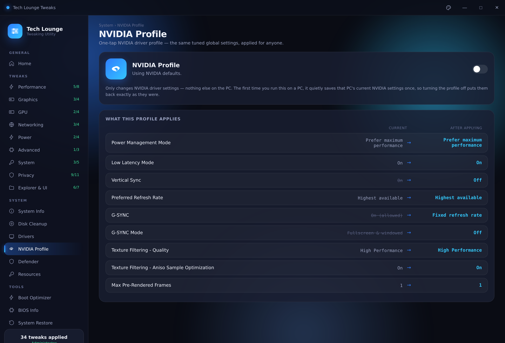
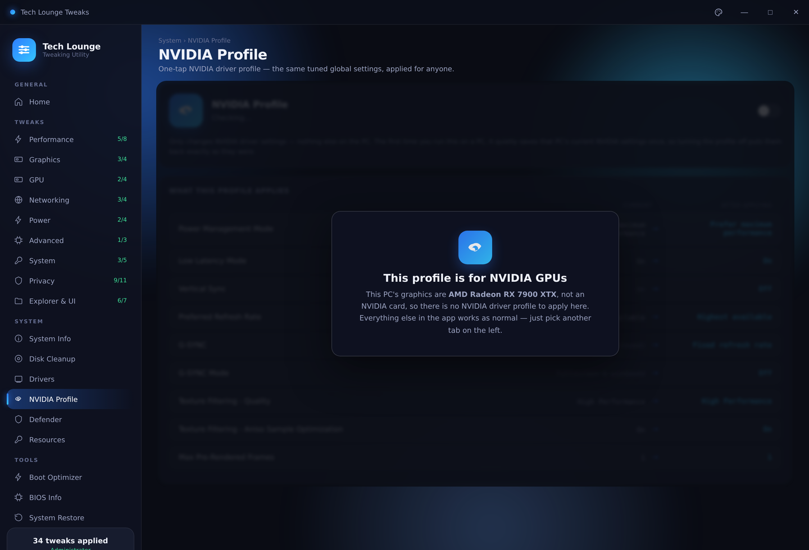
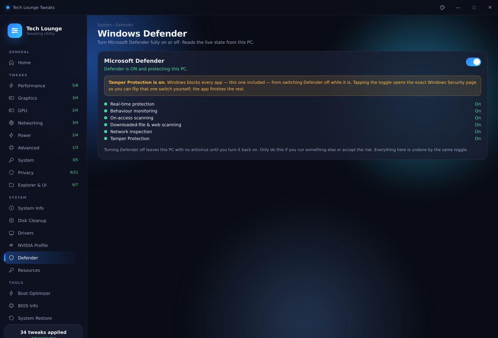
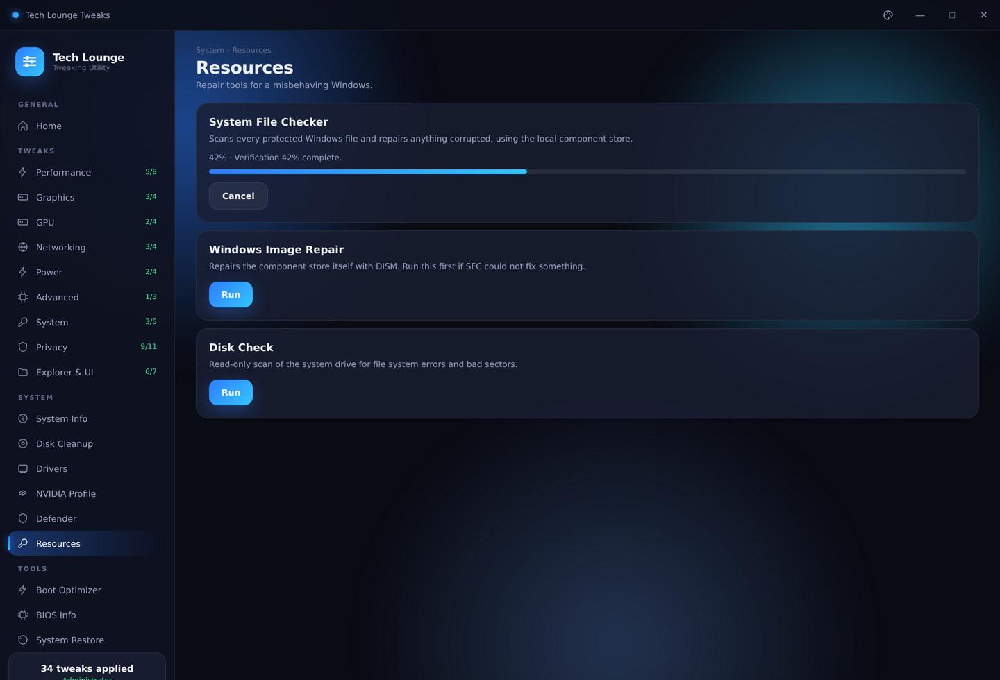
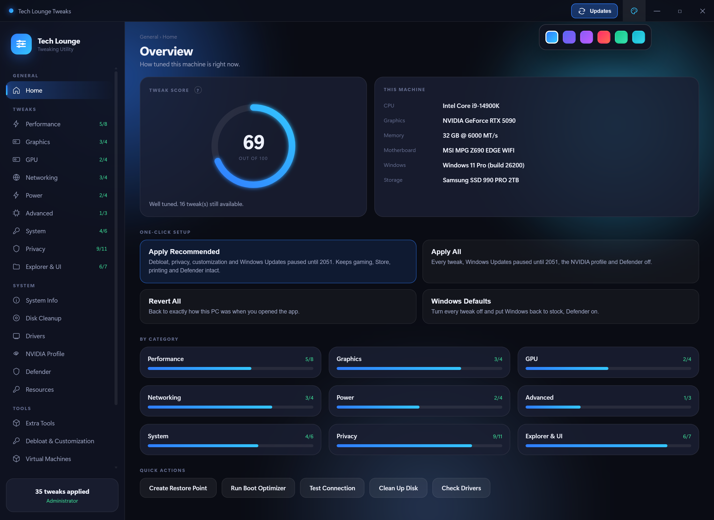
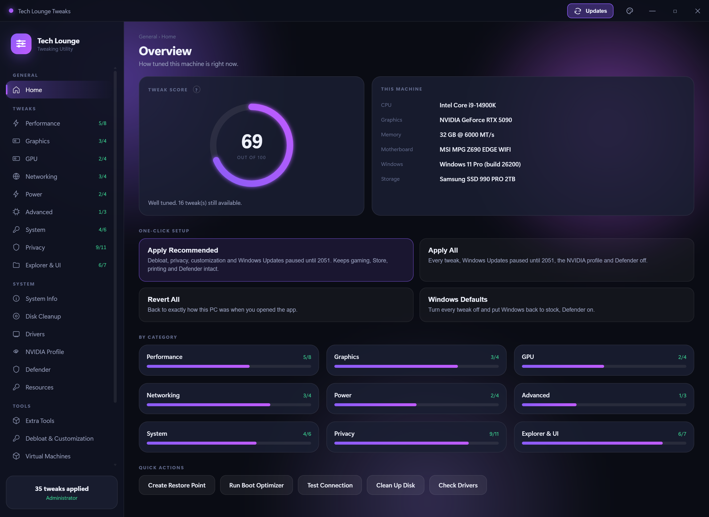

# Tech Lounge Tweaks

A Windows 11 tweaking utility built for The Tech Lounge. Toggle performance,
latency and privacy tweaks, apply a tuned NVIDIA driver profile in one tap,
turn Defender on or off, test your connection for bufferbloat, clean up junk
files and check your GPU drivers — all from one window.

Every page reads the **live** system state, so the app shows what is actually
set on your machine rather than assuming. Every toggle reverts, and one button
on the dashboard does the lot.


---

## Download

**[⬇ Download TechLoungeTweaks.zip](https://github.com/RaheemC4/tech-tips/raw/main/TechLoungeTweaks/TechLoungeTweaks.zip)** (15 MB)

1. Download the zip
2. **Extract it** somewhere you keep programs — `C:\Tools\` is a good spot.
   Do not run it from inside the zip, and avoid leaving it in Downloads
   (Windows cleans that folder out and scans it hard)
3. Open the extracted folder and run **TechLoungeTweaks.exe**

Keep the whole folder together. What you will see inside it:

```
TechLoungeTweaks\
├─ TechLoungeTweaks.exe     ← run this
├─ TL-api.log               ← plain-text log, for troubleshooting
├─ _internal\               ← the app itself, leave it alone
└─ resources\               ← NVIDIA Profile Inspector + the .nip profile
```

Only the exe and the log sit at the top level, so there is nothing to click on
by mistake. Moving the exe out on its own will not work.

### Why a folder and not one .exe

An earlier version was a single self-extracting exe. It unpacked ~46 MB to
your temp folder on *every* launch, which made startup slow and unpredictable,
and the self-extracting behaviour is exactly what antivirus heuristics look
for — Defender was flagging it as a false positive. The folder build starts
almost instantly and does not trip those scanners.

### First run

Windows will show a blue **"Windows protected your PC"** box, because the app
is not code-signed (a signing certificate costs a few hundred pounds a year,
which is not worth it for a free tool).

> Click **More info** → **Run anyway**

If your browser blocks the download itself with **"Virus detected"**, that is
the same false positive — use *Downloads → Keep* in the browser, or extract
with 7-Zip, which avoids Windows tagging the extracted files as
web-downloaded.

#### "Smart App Control blocked an app that may be unsafe"

This is a **different** dialog — it only has **Okay** and **Get apps from the
Store**, with no way to run the app anyway. That is Smart App Control, not
SmartScreen, and it blocks every unsigned program with no per-app override.

Only clean Windows 11 installs have it switched on. To check:

> Windows Security → App & browser control → Smart App Control

If it says **On**, the only ways round it are to turn it off or not run the app.

⚠️ **Turning Smart App Control off is permanent.** Microsoft does not allow it
to be switched back on afterwards — the only way to re-enable it is a clean
reinstall of Windows. Do not turn it off casually, and never on someone else's
machine without telling them that first.

If it says **Evaluation** or **Off**, this dialog is not what is stopping you —
see the SmartScreen steps above.

**It needs to run as administrator** and will prompt for that automatically,
because most of these settings live in `HKEY_LOCAL_MACHINE`.

### Requirements

| | |
|---|---|
| **Windows 11** | Works out of the box |
| **Windows 10** | Needs the [WebView2 runtime](https://developer.microsoft.com/microsoft-edge/webview2/) (free, from Microsoft) — the app checks on launch and links you to it if it is missing |
| **NVIDIA GPU** | Only needed for the NVIDIA Profile page; everything else works on any machine |

---

## Before you start

**Make a restore point.** There is a button for it under *Tools → System
Restore*. It takes about ten seconds and means any change here is reversible
even if something goes wrong.

Two tweaks will break games with kernel-level anti-cheat. They are marked
with a yellow warning in the app, but to be explicit:

- **Disable Memory Integrity** — Valorant (Vanguard) and FACEIT will refuse
  to launch.
- **Disable CPU Mitigations** — weakens Spectre/Meltdown protection.

Everything else is safe to try and safe to undo.

---

## What's in it

### Tweaks


Around 50 tweaks across nine categories. Each one shows whether it is
currently applied, and the toggle works both ways.

| Category | What it covers |
|---|---|
| **Performance** | GameDVR, Game Mode, fullscreen optimizations, power throttling, Ultimate Performance plan, CPU priority |
| **Graphics** | Hardware GPU scheduling, variable refresh rate, windowed optimizations, mouse acceleration |
| **GPU** | NVIDIA and AMD driver-level tweaks — only the ones for your card are shown |
| **Networking** | Nagle's algorithm, network throttling, offloads, firewall popups |
| **Power** | Dynamic tick, timer coalescing, USB selective suspend and power management |
| **Advanced** | Memory compression, page combining, CPU mitigations |
| **System** | Shutdown speed, menu delay, startup delay, SysMain, telemetry service |
| **Privacy** | Telemetry, activity history, advertising ID, error reporting, typing/speech/ink collection |
| **Explorer & UI** | Classic context menu, Bing in Start, snap layouts, lock screen, widgets, ads |

### One-click setup

Four buttons on the dashboard, for when you do not want to work through nine
categories by hand:

| Button | What it does |
|---|---|
| **Apply Recommended** | Every safe tweak, plus the NVIDIA profile and Defender off. Skips the four that cause trouble: Memory Integrity and CPU Mitigations (kernel anti-cheat / security), GameDVR and Fullscreen Optimizations (Xbox app, Game Bar overlay and some controllers). |
| **Apply All** | Everything, including the risky ones, plus the NVIDIA profile and Defender off. |
| **Revert All** | Puts every tweak back to exactly how this PC was the moment you first opened the app. |
| **Windows Defaults** | Turns every tweak off, restores NVIDIA settings and turns Defender back on — Windows as it ships. |

Both apply buttons check for an NVIDIA GPU first and quietly skip the driver
profile if there isn't one. Every switch flips the moment you click, with the
registry write happening behind it, so nothing ever looks frozen mid-apply.

### NVIDIA Profile



One toggle applies a tuned set of global NVIDIA driver settings — the same
profile for everyone, so there is no "what did you set yours to" in chat.

**NVIDIA Profile Inspector (Revamped) ships inside the zip**, in the
`resources` folder. Nothing to download.

The table lists every setting the profile touches: what your driver holds
**right now** on the left, what it becomes on the right, with the changed ones
struck through. Highlights include Power Management on *Prefer maximum
performance*, Low Latency Mode *Ultra*, Preferred Refresh Rate *Highest
available*, and G-SYNC on for fullscreen **and** windowed.

**How reverting works.** The first time you open the app on a PC with an
NVIDIA card, it quietly exports that PC's current NVIDIA settings once and
keeps the file in `%LOCALAPPDATA%\TechLoungeTweaks`. Turning the profile off
restores *your* original settings, not a generic default. That backup is taken
once per machine, is never overwritten, and is never shared.

**It re-checks itself every launch.** The app reads your live driver settings
in the background at startup rather than trusting its own record, so anything
you changed in the NVIDIA Control Panel, in Profile Inspector directly, or
that a driver reinstall reset shows up correctly. If only part of the profile
is live you get *"Partly applied — 7 of 39 settings match"* rather than a
toggle that quietly lies. The read is warmed on startup, so the page is
already filled in by the time you click the tab.

Only NVIDIA driver settings are touched — nothing else on the PC.

**On a machine without an NVIDIA card** the page seals itself and names the GPU
it actually found, so nobody applies a driver profile that cannot do anything.
Every other tab keeps working normally.



### Windows Defender



One toggle for the whole of Microsoft Defender, with the live state of each
component listed underneath.

**Tamper Protection.** Since Windows 10 1903, Windows blocks *every* app —
this one included — from switching real-time protection off while Tamper
Protection is on. There is no legitimate way around that, and anything
claiming otherwise is using a malware technique. So the toggle opens the exact
Windows Security page for you to flip that one switch yourself, then finishes
the rest. The same toggle turns everything back on.

Turning Defender off leaves the PC with no antivirus until it goes back on.

### Connection test


A proper bufferbloat test — it measures your idle ping, then measures it
again while saturating the line in each direction. The gap between the two is
what makes games feel laggy when someone else is streaming.

Reports download and upload speed, ping, **jitter**, and a plain-English
verdict on what your connection can handle. Hover any **?** for an
explanation of what the number means and what a good value looks like.

### System information


CPU, motherboard, memory (including whether XMP looks active), graphics,
storage health and network adapters. Read once in the background while the app
opens, so switching tabs is instant.

### Tools

- **Boot Optimizer** — detects your CPU and GPU, then applies startup and
  shutdown tuning that suits them. Preview shows exactly what would change
  before you commit. Secure Boot, TPM and VBS are never touched, so kernel
  anti-cheat keeps working. Every change is written to a rollback file.
- **Disk Cleanup** — temp files, Windows Update cache, delivery optimization,
  crash dumps, thumbnails. Shows size per item, you pick what goes.
- **Drivers** — checks your installed NVIDIA driver against the latest
  release from NVIDIA's own lookup service. Versions are compared as numbers,
  so a beta or hotfix that is *newer* than the public release is reported as
  ahead rather than as an update you are missing.
- **Resources** — SFC, DISM and a read-only disk check, each with a clear
  verdict on whether anything was actually wrong.
- **BIOS Info** — firmware version, boot mode, Secure Boot, TPM,
  virtualization and memory speed.

### While something is running



Scans and downloads take minutes, so the app tracks them properly rather than
freezing a button. While one is going, the **Run** / **Download** button is
replaced by **Cancel** and a progress bar showing the tool's own real
percentage, with its current output line underneath.

The job lives in the app itself, not the page, so you can switch to another tab
and come back to find it still running at the right progress. It will not let
you start a second copy of something already going, and cancelling a download
removes the half-finished file.

---

## Themes



The palette button in the title bar switches the whole app between blue,
blurple, purple, red, green and cyan. Everything follows — the icon, the score
ring, buttons, selections and the background glow. Your choice is remembered
between launches.



The window is fully resizable, and drags at your monitor's refresh rate.

---

## A note on BIOS tweaks

The BIOS page is **read-only by design**.

Dell, HP and Lenovo publish supported WMI interfaces for changing firmware
settings from Windows, and the app will use them where it finds one.
Consumer boards (ASUS, MSI, Gigabyte, ASRock) publish nothing equivalent —
the only route in is writing firmware NVRAM through an undocumented driver,
and a bad write bricks the board with no way back.

Change those settings in the firmware itself at POST.

---

## Undoing things

- Everything at once — **Revert All** on the dashboard puts the machine back to
  how it was when you first opened the app, or **Windows Defaults** puts it back
  to stock Windows.
- Any individual tweak — toggle it off.
- A whole category — **Revert All** at the top of the page.
- NVIDIA profile — toggle it off; your own pre-profile settings come back.
- Defender — the same toggle turns it back on.
- Boot Optimizer — the **Undo** button restores from its rollback file.
- Everything, including things this app never touched — Windows System
  Restore, using the point you made before you started.

---

## Something not working?

`TL-api.log` sits next to the exe and records what the app did, in plain text.
If something misbehaves, that file says why — send it over.

---

## Credits

Built for The Tech Lounge Discord community. Tweaks are drawn from the
server's tech-tips archive plus documented Windows settings.

Bundles [NVIDIA Profile Inspector Revamped](https://github.com/xHybred/NVIDIAProfileInspectorRevamped)
by xHybred for the NVIDIA Profile page.

Use at your own risk — read what a tweak does before applying it.
