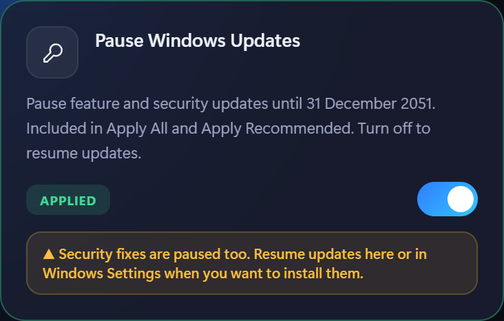
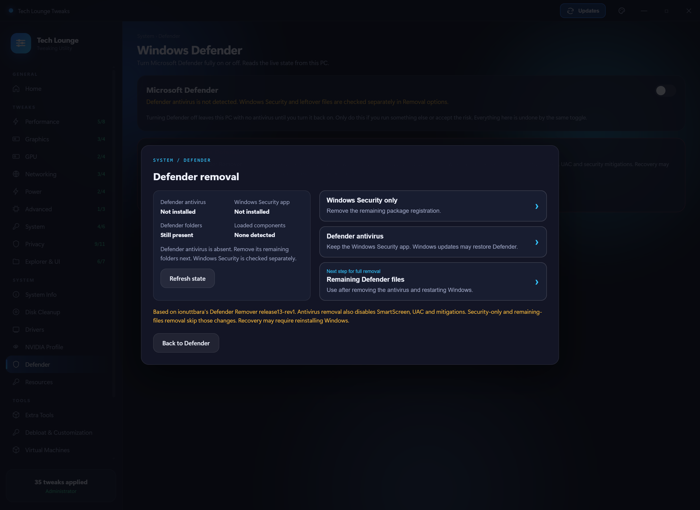
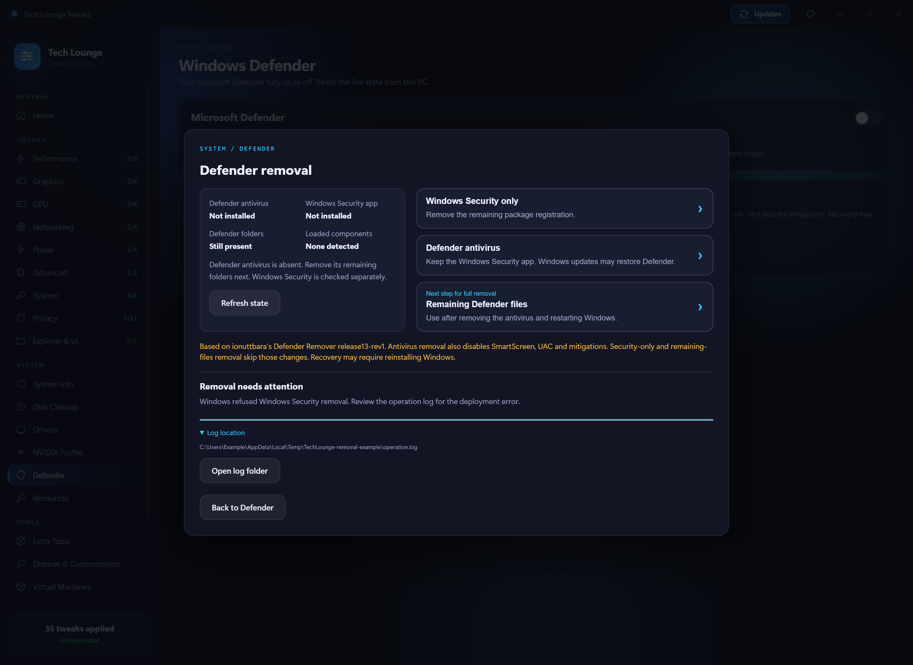
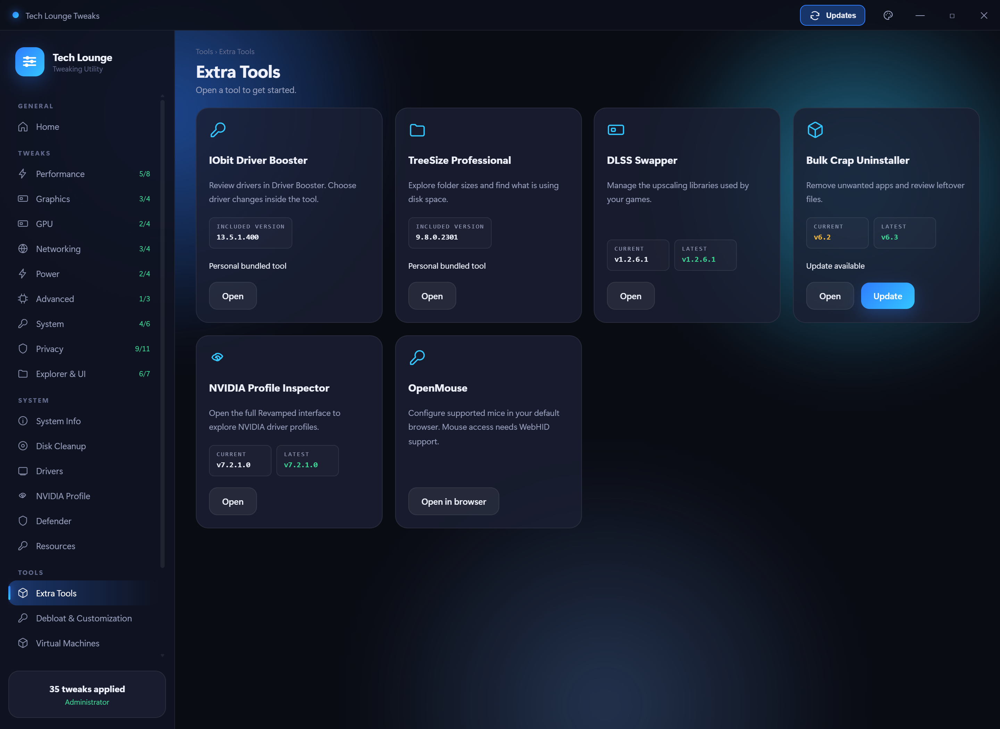
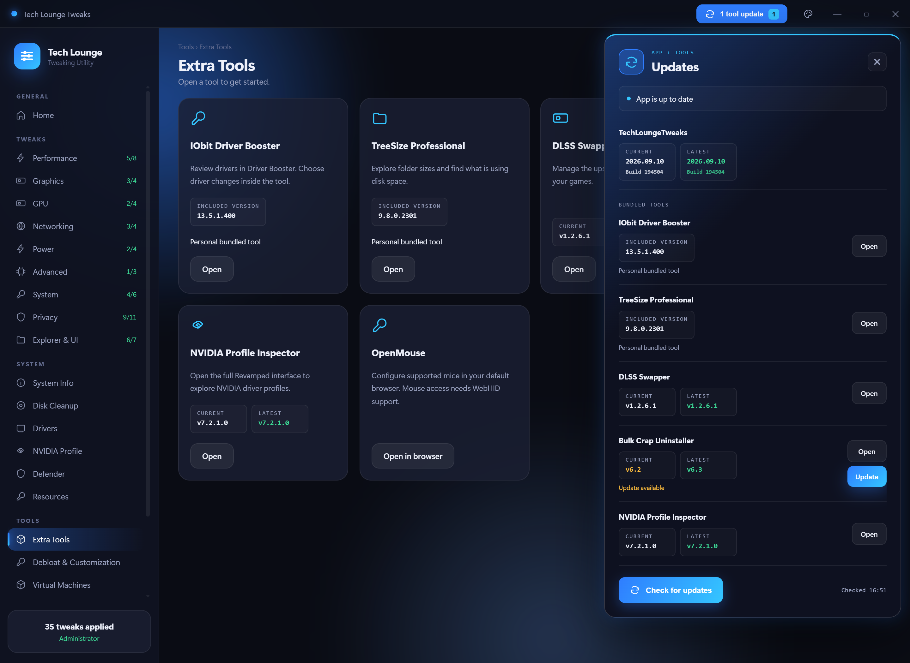

# Tech Lounge Tweaks

A Windows 11 tweaking utility built for The Tech Lounge. Toggle performance,
latency and privacy tweaks, apply a tuned NVIDIA driver profile in one tap,
turn Defender on or off, install runtimes, browsers and game clients silently,
test your connection for bufferbloat, clean up junk files and check your GPU
drivers — all from one window.

Tool closure hands input back to the host before hiding the tool, and slow shutdown
no longer triggers an automatic reopen. NVPI caption covers are host-owned windows,
clipped to its rounded frame without cross-process child-window parenting.
The NVPI covers use the selected publisher theme's original header colour.
NVPI starts under a hidden host-owned staging window, then transfers to the main
host once fitted. This keeps startup rendering hidden without repeatedly emptying
its window region; the extra fixed settling delay is skipped when staging succeeds.
Its Open button shows **Opening…** until the subwindow is ready. Driver/profile
initialization still takes time. BCU and DLSS keep their existing launch paths.
Saved maximization, splash and backdrop settings are normalized before launch;
the startup guard also handles late titles and restored bounds. NVPI retains
control of its WPF nonclient rendering rather than forcing a DWM frame reset.
NVPI settings tolerate the publisher file's mismatched UTF-8/UTF-16 declaration
and are saved with a matching encoding. BCU's native caption and system buttons
are removed, including if loading restores them, so its red X cannot cover the
host's themed close button. The tool is hidden before the host UI is activated.
Native fixtures exercise slow closure against a competing foreground window;
live compatibility with each publisher still requires verification.

The Defender chooser distinguishes installed app files from leftover Windows Security
package registrations. With the antivirus absent, remaining folders are recommended
for cleanup; Security-only removal skips antivirus and broader security changes.

Mouse back/forward buttons and Alt+Left/Right navigate between visited pages.
The main window opens centred in the usable area of the monitor containing the mouse pointer.

Every page reads the **live** system state, so the app shows what is actually
set on your machine rather than assuming. The dashboard has a curated recommended
preset, and individual pages explain the scope and undo options for their changes.


---

## Download

**[⬇ Download TechLoungeTweaks.zip](https://github.com/RaheemC4/tech-tips/releases/latest/download/TechLoungeTweaks.zip)**

1. Download the zip
2. **Extract it** somewhere you keep programs — `C:\Tools\` is a good spot.
   Do not run it from inside the zip.
3. Open the extracted folder and run **TechLoungeTweaks.exe**

Keep the whole folder together. What you will see inside it:

```
TechLoungeTweaks\
└─ TechLoungeTweaks.exe     ← run this
```

Only the launcher is visible with Explorer's normal hidden-file setting. Required
`_internal` and `resources` folders are hidden, not removed. Keep them with the exe;
moving the exe alone will not work. Logs live in
`%LOCALAPPDATA%\TechLoungeTweaks\Logs\TL-api.log`. The whole distribution uses
maximum standard ZIP Deflate compression and opens with Windows Explorer.

### Packaging and first launch

The standard release uses a PyInstaller folder build for Intel/AMD x64 Windows.
It includes BCU's complete x64 runtime and omits its separate ARM64 payload to
reduce the download and extracted size. Bundled tools remain available offline. Keep the entire extracted
folder together. Folder packaging avoids extracting the runtime on every launch,
but does not guarantee acceptance by antivirus or Windows reputation checks.

The Nuitka packaging experiment has been retired after testing did not resolve Defender detections. Use the standard download above.

The app is unsigned. SmartScreen reputation warnings, Smart App Control blocks,
and antivirus quarantine are different outcomes. If a file is quarantined,
record the detection name and affected file for investigation; do not assume
that every detection is a false positive. Changing ZIP extraction software or
removing a downloaded-file marker does not resolve antivirus detections.

The app requests administrator access for system-wide settings. WebView2 is
also required, as described below.

### Requirements

| | |
|---|---|
| **Windows 11** | Works out of the box |
| **Windows 10** | Needs the [WebView2 runtime](https://developer.microsoft.com/microsoft-edge/webview2/) (free, from Microsoft) — the app checks on launch and links you to it if it is missing |
| **NVIDIA GPU** | Only needed for the NVIDIA Profile page; everything else works on any machine |
| **App Installer / winget** | Optional. Install Apps prefers it, and falls back to direct vendor downloads when a debloated image has removed it |

---

## Before you start

**Make a restore point.** There is a button for it under *Tools → System
Restore*. It takes about ten seconds and means any change here is reversible
even if something goes wrong.

Two tweaks will break games with kernel-level anti-cheat. They are marked
with a yellow warning in the app, but to be explicit:

- **Disable Memory Integrity** — Valorant (Vanguard) and FACEIT will refuse
  to launch.
- **Disable CPU Mitigations** — weakens Spectre/Meltdown protection.

Read each option before applying it. App removal and clearing Start pins are
not reversed by the dashboard's Revert All button.

---

## What's in it

### Tweaks


Around 50 tweaks across nine categories. Each one shows whether it is
currently applied, and the toggle works both ways.

| Category | What it covers |
|---|---|
| **Performance** | GameDVR, Game Mode, fullscreen optimizations, power throttling, Ultimate Performance plan, CPU priority |
| **Graphics** | Hardware GPU scheduling, variable refresh rate, windowed optimizations, mouse acceleration |
| **GPU** | NVIDIA and AMD driver-level tweaks — only the ones for your card are shown |
| **Networking** | Nagle's algorithm, network throttling, offloads, firewall popups |
| **Power** | Dynamic tick, timer coalescing, USB selective suspend and power management |
| **Advanced** | Memory compression, page combining, CPU mitigations |
| **System** | Sticky/Filter/Toggle keys (the Shift x5 pop-up), shutdown speed, menu delay, startup delay, SysMain, telemetry service |
| **Privacy** | Telemetry, activity history, advertising ID, error reporting, typing/speech/ink collection |
| **Explorer & UI** | Classic context menu, Bing in Start, snap layouts, lock screen, widgets, ads |

### One-click setup

Four buttons on the dashboard, for when you do not want to work through nine
categories by hand:

| Button | What it does |
|---|---|
| **Apply Recommended** | Curated privacy settings, Windows Updates paused until 31 December 2051, optional bundled-app removal and the customization choices listed below. Leaves gaming tweaks, Xbox, Game Bar, NVIDIA settings, Defender and virtualization alone. |
| **Apply All** | Asks for confirmation, then applies the legacy tweaks (including Windows Updates paused until 2051 and risky ones), NVIDIA profile, Defender off and the curated Debloat & Customization options. |
| **Revert All** | Restores the legacy tweaks from the app's saved original values. Does not reinstall removed apps or restore Start pins. |
| **Windows Defaults** | Turns legacy tweaks off, restores NVIDIA settings and enables Defender. Does not undo the new debloat actions. |

Apply All checks for an NVIDIA GPU before applying its driver profile. Recommended
uses the same preset from the dashboard and the Debloat & Customization page.

### Pause Windows Updates

**System → Pause Windows Updates** pauses feature and security updates until
31 December 2051 using the pause-date settings from
[Aetherinox/pause-windows-updates](https://github.com/Aetherinox/pause-windows-updates#registry-scripts).
Both **Apply Recommended** and **Apply All** include it. The toggle reads the
current registry pause dates/status; Windows can override them after servicing
or organization policy changes. Turn the toggle off, use Windows Defaults or
choose Resume updates in Windows Settings to resume updates.

This integration changes the pause dates and pause-duration limit; it does not
change update services, active hours, WSUS or driver-update policy. Security
fixes are paused too, so resume updates when you want to install them. The
reviewed source revision and MIT licence are bundled; no script is downloaded
or run from the internet when applying a preset.



### Debloat & Customization


This page integrates selected helpers and settings from
[Win11Debloat](https://github.com/Raphire/Win11Debloat). It does not run the
upstream default preset. Existing options such as Bing search remain in their
original tabs instead of appearing twice.

**Apply Recommended** selects these customization changes: show file extensions
and hidden files, hide Home from Explorer navigation, align the taskbar left,
hide the taskbar search icon, show clock seconds, enable dark theme, hide
"Learn about this picture", clear existing Start pins once, use the Start All
Apps list, hide Start recommendations, disable Bing and Copilot in search, hide
Task View and enable the taskbar End Task option.

It also applies selected privacy and advertising settings and disables Copilot,
Recall, Click to Do and AI additions in Paint, Notepad and Edge. The optional
packaged apps selected for removal are Clipchamp, Cortana, Bing Finance, News,
Sports and Weather, Get Started, the Microsoft 365 promotional hub, Mixed Reality
Portal, Skype and the packaged Copilot app. Missing apps are already satisfied.
Xbox, Game Bar, Gaming Services, Microsoft Store, printing and Windows framework
packages are excluded. Gaming settings are not changed by Recommended.

The switches select what the next **Apply selected** action will do; the status
beside each option reports its detected state. **Apply all** asks for confirmation.
Hide Gallery and hide duplicate drives are optional and off in Recommended.
Unavailable options show their minimum Windows build and are skipped. Some Start
policies depend on edition and feature rollout: a stored policy does not guarantee
that every Windows build will change its appearance. Sign out or restart manually
if Windows has not refreshed the interface.

**Clearing Start pins is a one-time action per existing user profile** with a
Start layout file. It does not lock the layout or change the default profile;
users can pin apps again. Successfully processed profiles are recorded so later
runs preserve newly added pins. The upstream helper backs up the old layout beside
the profile's `start2.bin` file.

Registry changes have individual **Undo** actions using upstream undo settings.
Registry backups and the last run log are kept under
`%LOCALAPPDATA%\TechLoungeTweaks\Debloat`. Undo is not offered for removed apps or
cleared pins; reinstall wanted apps through Microsoft Store and repin them yourself.

### NVIDIA Profile


One toggle applies a tuned set of global NVIDIA driver settings — the same
profile for everyone, so there is no "what did you set yours to" in chat.

**NVIDIA Profile Inspector (Revamped) ships inside the zip**, in the
`resources` folder. Tools & Updates can install newer official Inspector releases.

The table lists every setting the profile touches: what your driver holds
**right now** on the left, what it becomes on the right, with the changed ones
struck through. Highlights include Power Management on *Prefer maximum
performance*, Low Latency Mode *Ultra*, Preferred Refresh Rate *Highest
available*, and G-SYNC on for fullscreen **and** windowed.

**How reverting works.** The first time you open the app on a PC with an
NVIDIA card, it quietly exports that PC's current NVIDIA settings once and
keeps the file in `%LOCALAPPDATA%\TechLoungeTweaks`. Turning the profile off
restores *your* original settings, not a generic default. That backup is taken
once per machine, is never overwritten, and is never shared.

**It re-checks itself every launch.** The app reads your live driver settings
in the background at startup rather than trusting its own record, so anything
you changed in the NVIDIA Control Panel, in Profile Inspector directly, or
that a driver reinstall reset shows up correctly. If only part of the profile
is live you get *"Partly applied — 7 of 39 settings match"* rather than a
toggle that quietly lies. The read is warmed on startup, so the page is
already filled in by the time you click the tab.

Only NVIDIA driver settings are touched — nothing else on the PC.

**On a machine without an NVIDIA card** the page seals itself and names the GPU
it actually found, so nobody applies a driver profile that cannot do anything.
Every other tab keeps working normally.


### Windows Defender


One toggle for the whole of Microsoft Defender, with the live state of each
component listed underneath.

**Tamper Protection.** Since Windows 10 1903, Windows blocks *every* app —
this one included — from switching real-time protection off while Tamper
Protection is on. There is no legitimate way around that, and anything
claiming otherwise is using a malware technique. So the toggle opens the exact
Windows Security page for you to flip that one switch yourself, then finishes
the rest. The same toggle turns everything back on.

**The antimalware service stays in memory.** With everything switched off you
will still see `MsMpEng.exe` running, and Windows still reports the service as
enabled. That is normal and not a failed toggle — Windows keeps the service
resident for as long as Defender is the installed antivirus, and nothing can
unload it. What matters is real-time protection, which is what the toggle
follows and what actually scans files. The page says as much underneath the
component list so it is not mistaken for something that did not work.

Turning Defender off leaves the PC with no antivirus until it goes back on.

**Permanently remove Defender.** The button opens a themed, mouse-operated chooser
inside the app, using a reviewed adapter for the bundled
[Defender Remover](https://github.com/ionuttbara/windows-defender-remover)
(release13-rev1). Choose Defender plus Windows Security, antivirus removal while
keeping the Security app, or remaining files after removal and restart. Each
choice requires confirmation. Antivirus removal choices also disable SmartScreen,
UAC, VBS and other protections; recovery may require reinstalling Windows.
Save work and make a system backup first.

The chooser reads this PC when opened: antivirus service, Windows Security package
registrations and manifests, remaining Defender folders and loaded engine/filter.
A package record without app files is labelled **Not installed**. When the antivirus is absent and no components remain loaded,
**Remaining Defender files** is recommended if folders remain. The combined option
is recommended only when both apps are installed. When Defender is absent, that
option becomes **Windows Security only** and runs an explicitly limited worker mode,
without antivirus registry changes or SmartScreen removal. Unknown checks stay **Unknown**.

The SHA-256-verified payload runs without a separate console. Progress and errors
appear inside the app; an operation log is retained. Returning to the Defender
page preserves progress, and the app waits for removal to finish before closing.
The Security adapter derives a validated family name even when only a provisioning
record remains, and checks the DISM removal-policy operation before attempting removal.
A failed policy step stops that package's removal attempt. There is no blind retry.
When antivirus removal is selected and its service exists, the original registry
payloads still run through `regedit /s`. Warnings remain visible rather than being
reported as a clean removal. AppX diagnostics are limited to the current operation's
time window, so earlier logon errors are not presented as this attempt's cause.
Expand **Log location** and choose **Open log folder** to inspect the operation and
servicing logs. A missing manifest or a remaining policy restriction can still
prevent Windows from removing a damaged package; this release does not claim
successful removal on the affected PC without a real post-operation check.
Restart Windows manually after completion and refresh Defender status. There is
no forced restart or scheduled logon console. The upstream CC BY-NC 4.0 licence
and attribution are included. This adapter updates through reviewed app releases.
Validation uses fixtures and mocked removal calls; actual removal is not run on
the development PC.





### Connection test


A proper bufferbloat test — it measures your idle ping, then measures it
again while saturating the line in each direction. The gap between the two is
what makes games feel laggy when someone else is streaming.

Reports download and upload speed, ping, **jitter**, and a plain-English
verdict on what your connection can handle. Hover any **?** for an
explanation of what the number means and what a good value looks like.

### System information


CPU, motherboard, memory (including whether XMP looks active), graphics,
storage health and network adapters. Read once in the background while the app
opens, so switching tabs is instant.

### Tools

- **Windows setup** — under Resources, shows your current Windows name, edition,
  release, build and activation status. If the displayed status is already
  activated, **Activate Windows** immediately shows a dialog without loading MAS.
  Otherwise it checks licensing before opening the bundled MAS HWID tool.
  Each action clears old feedback and shows a loading indicator.
  **Change Windows Version** opens a mouse-operated chooser inside the app,
  shows the current edition and lists Windows-supported target editions. The
  scrollable list has a slim, rounded theme-accent scrollbar with room beside
  the buttons; mouse-wheel and keyboard scrolling remain available.
  A second confirmation names the selected target before applying it through a
  hidden helper. This does not upgrade Windows 10 to 11 or offer unsupported
  downgrade paths. Edition changes may need activation and a manual restart;
  the app never restarts the PC automatically. Use **Refresh status** to recheck.
- **Boot Optimizer** — detects your CPU and GPU, then applies startup and
  shutdown tuning that suits them. Preview shows exactly what would change
  before you commit. Secure Boot, TPM and VBS are never touched, so kernel
  anti-cheat keeps working. Every change is written to a rollback file.
- **Disk Cleanup** — temp files, Windows Update cache, delivery optimization,
  crash dumps, thumbnails. Shows size per item, you pick what goes.
- **Drivers** — checks your installed NVIDIA driver against the latest
  release from NVIDIA's own lookup service. Versions are compared as numbers,
  so a beta or hotfix that is *newer* than the public release is reported as
  ahead rather than as an update you are missing.
- **Resources** — SFC, DISM and a read-only disk check, each with a clear
  verdict on whether anything was actually wrong.
- **BIOS Info** — firmware version, boot mode, Secure Boot, TPM,
  virtualization and memory speed.
- **Install Apps** — runtimes, browsers and game clients, installed silently
  from the vendor. See below.
- **Virtual Machines** — switch the CPU between VirtualBox and Windows'
  hypervisor-backed security. See below.

### Extra Tools and updates



This personal build also includes **IObit Driver Booster 13.5.1.400** and
**TreeSize Professional 9.8.0.2301** from the supplied archives. Open launches their
application executables directly in the host's floating tool frame. Their custom
headers remain accessible. They show an **Included version**, and TechLoungeTweaks
does not automatically replace them with a different publisher or repack version.
TreeSize's About window is verified as Professional 9.8.0.2301, and Driver Booster
is confirmed displaying 13.5 Pro (bundled executable 13.5.1.400). Both packaged
executables match the supplied archive hashes. Their duplicate window controls
are clipped while menus remain accessible; the host frame supplies the tool Close
button and keeps both tools centered during custom window movement.
Before Driver Booster opens, the repack's supplied settings are applied to disable
its own automatic product updates, automatic scans and automatic driver downloads,
and make Close exit rather than minimize to the tray. Existing unrelated preferences
are retained, with a first settings backup. Launch checks the bundled executable's
hash and refuses a different running copy, preventing a locally installed Free
version from intercepting the Open action.
Driver changes and disk cleanup are choices made inside each tool, never automatic
actions of opening a tool or applying the dashboard's presets.

The third-party portable launchers, website shortcuts, registry-import wrappers,
and the encrypted `thanks4dl.rar` payload are excluded. These two supplied builds
contain modified executables with invalid publisher signatures; integration and
window tests do not establish their safety or validate their licences.

**DLSS Swapper, Bulk Crap Uninstaller (BCU) and NVIDIA Profile Inspector Revamped
come bundled and ready to open.** No separate installation or first-run download
is needed. BCU includes its .NET runtime for this x64 distribution. Its
welcome wizard is skipped through its portable first-run setting; other existing
preferences are preserved. The integrated frame targets BCU's main window rather
than its welcome, news or legend dialogs.
Startup window events suppress the initial surface before the integrated frame
is ready, including BCU's child-process startup.
Choose **Open** to use each complete app in an integrated frame inside
TechLoungeTweaks. DLSS, BCU and NVPI native title bars and window buttons are hidden;
BCU's standard caption is removed rather than cropped using an estimated height.
the tool has no separate taskbar or Alt-Tab entry and cannot be resized independently.
Press and hold the empty frame strip above the tool, then drag to move the entire
TechLoungeTweaks window. The gesture is handed to Windows on the window UI thread
so mouse capture is released correctly. Minimize and maximize/restore also run
on that UI thread and target the current app instance. Native
movement events keep the pair together without the old position-reset loop.
Only an actual drag moves the host: programmatic tool layout, maximization and
shutdown movements do not. NVPI attaches by its main-window title and restores
saved maximized state to Normal before launch, then fits it inside the frame. Positioning uses native
monitor DPI coordinates.

Click the blurred backdrop to **hide** the tool while its work continues. Open
restores the same session. The themed **X closes only the tool**, using its normal
close request so save/busy prompts can still appear. Publisher menus and client
controls retain their own styling. Closing a tool returns focus to the host;
the close icon is a centred SVG. NVPI keeps its profile selector header visible
while its native caption and custom window buttons are hidden. The frame follows
your selected theme. Minimizing TechLoungeTweaks minimizes its visible tool without ending the session;
restoring it brings that tool back. Tools hidden using the backdrop stay hidden
until Open is pressed. Closing TechLoungeTweaks requests closure of all hosted
tools, including hidden ones. If a tool needs a save/busy prompt handled, the main
app stays open until it can close, so no tool is left orphaned on the desktop.

The official managed tools show **Current** and **Latest** versions. An older current version is
yellow with an **Update available** label; the latest release is green. **Update**
is shown when a newer official release is available. Open remains available during
checks. Updated Inspector binaries are used by the existing NVIDIA Profile page;
your curated profile and original-settings backup stay separate.

**OpenMouse** opens the [official live panel](https://control.openmouse.app/) in your default
browser. Newly published mouse support comes from that panel without an app rebuild.
Mouse access needs WebHID support, such as Edge or Chrome. If your default browser
lacks it, use a compatible browser and select your mouse in the device picker.
Remote pages never receive the local administrator API bridge.



**Updates and the theme picker remain above open tools.** Their panels take
priority for both display and clicks while the rest of the tool stays visible
and running. Dismissing a panel restores the covered part of the tool.

The title-bar **Updates** button opens a compact floating panel available from any
page. It is separate from the tool modules. **App update** and **tool update** labels
identify what needs updating; an Inspector release never claims that the main app
is outdated. There is no introductory update card or automatic popup. The panel
also offers Open and Update, separate Current/Latest version tiles, and a prominent
Check for updates button. Its accent follows your selected theme. Unavailable
checks show a neutral label, never a raw release timestamp or false green version.

Checks run in the background without blocking startup or navigation. Bundled tools
remain available offline; failed checks do not claim that an update exists. Clicking
Update starts a verified background download with progress and cancellation. App
updates require an explicit **Restart & apply** after tracked jobs finish and tool
windows close. The old
app folder is retained beside the installation and restored if replacement fails.
The last replacement result is in `%LOCALAPPDATA%\TechLoungeTweaks\Updates\last-update.txt`.
Completed app downloads remain ready after closing the app.

Official stable tool downloads verify publisher SHA-256 checksums and archive paths
and sizes before activating a complete staged version. Unsupported packaging or
missing checksums leave the previous version intact. Cancellation during unpacking
takes effect after extraction. Close an open tool and reopen it to use its update.
Previous managed versions and their files remain under
`%LOCALAPPDATA%\TechLoungeTweaks\Updates`; a Previous version action appears beside a tool
only when a previous version exists. There is no empty More options section. Publisher-specific portable settings are retained
with their original version; automatic settings migration is not guaranteed.

Win11Debloat and Microsoft Activation Scripts are hidden from the user-facing
update list. Their reviewed adapters still change through tested full app releases.
Windows policies and upstream interfaces can change, so future compatibility still
requires maintenance. Install Apps entries remain vendor-installed software with
their own update mechanisms.

App update identity is based on shipped contents, not a fresh packaging timestamp.
Rebuilding or republishing the same software does not count as a new app version.
A complete release ZIP is uploaded to **GitHub Releases**, with its source, README,
release notes and screenshots committed to the repository. The larger bundled ZIP
is not committed as a Git file. PUSH-TO-GITHUB.bat handles both steps; preparing a
release alone does not publish it.

### While something is running


Scans and downloads take minutes, so the app tracks them properly rather than
freezing a button. While one is going, the **Run** / **Download** button is
replaced by **Cancel** and a progress bar showing the tool's own real
percentage, with its current output line and an elapsed timer underneath.

**Windows Image Repair legitimately takes 10–30 minutes** and will sit on one
percentage for long stretches — that is DISM working, not the app hanging. The
elapsed timer keeps ticking so you can tell the difference, and Cancel stops it
cleanly at any point.

The job lives in the app itself, not the page, so you can switch to another tab
and come back to find it still running at the right progress. It will not let
you start a second copy of something already going, and cancelling a download
removes the half-finished file.

### Virtual Machines


Two buttons, in plain English:

| | |
|---|---|
| **Virtual Machines** | Pick this to run VirtualBox, VMware or WSL properly. VMs run at full speed instead of crawling, and it fixes VirtualBox failing to start a machine. |
| **Gaming & Normal Use** | Pick this for everyday use and playing games. Memory Integrity stays off so installers and games stay fast. VMs still run, just slower. |

Whichever one is live is marked **ACTIVE NOW**, so there is never any doubt
which state the PC is in. **Apply Recommended** leaves this choice unchanged.

Why this is a choice at all: VirtualBox wants the CPU's virtualisation
directly, but Windows runs its own hypervisor for Memory Integrity, WSL2,
Docker and Sandbox. Whoever holds it, the other loses out.

**Memory Integrity is left off by both modes.** Turning it on taxes every
driver load — an earlier build enabled it and MSI installers slowed to a crawl
on a machine that had shipped with it off. Nothing here will ever switch it on
behind your back. The one exception worth knowing: **Valorant can ask for
Memory Integrity to be on**. If Vanguard complains, turn it on yourself in
*Windows Security → Device security → Core isolation*, and the app will leave
it alone.

**Neither button touches Secure Boot or TPM.** Those are firmware settings and
this app has no business changing them.

The hypervisor setting is recorded the first time you open the page, so
switching back restores *your* machine's value rather than a Windows default.

**Either choice needs a restart** — the hypervisor setting is applied at boot.

If CPU virtualisation is switched off in your BIOS the page says so in red, with
what to turn on (Intel VT-x, or SVM Mode on AMD). No software setting can work
around that one.

### Install Apps


Runtimes, browsers and game clients, installed silently — the useful half of a
toolbox like Ghost's, without the baggage.

| Group | What's in it |
|---|---|
| **Chat & voice** | Discord with the latest OpenAsar nightly, Discord PTB |
| **Tuning tools** | MSI Afterburner (GPU overclocking/monitoring — installed without RivaTuner/RTSS; overclocking done in the real tool, never by this app) |
| **Runtimes** | Visual C++ Redistributables (2005–2022, x86 + x64), DirectX web installer, .NET Desktop Runtime 8 |
| **Browsers** | Edge & WebView2, Brave, Chrome, Firefox, Opera GX, Vivaldi |
| **Game clients** | Steam, Epic, Ubisoft Connect, EA App, GOG Galaxy, Battle.net, Rockstar, Amazon Games |

Each card shows how it will be installed. **WINGET** goes through the Windows
Package Manager, which is built into Windows 11 and keeps its own download
URLs and silent switches current — nothing to rot. **DIRECT** downloads
straight from the vendor's own domain. **MANUAL** means neither route is
available and the vendor page is the way in.

Downloads are checked against an allowlist of vendor domains before anything
is fetched, so a link that is not on the vendor's own domain is refused.
Installers run with their official silent switches. These installers are downloaded on demand, and nothing is repacked or modified.

The **Discord** card also installs the current unmodified OpenAsar nightly from
its official GitHub release. It finds the highest numeric `app-*` version under
`%LOCALAPPDATA%\Discord`, verifies the asset against the SHA-256 digest supplied
by GitHub, keeps Discord's stock `app.asar.backup`, and atomically replaces the
latest version's `resources\app.asar`. Running the card again repairs OpenAsar
if a later Discord update replaces it.

Before Discord restarts, the app merges these OpenAsar choices into
`%APPDATA%\discord\settings.json`: Performance focus, No Track on, Disable
Typing on, Splash Theming on, Quickstart on and Multi Instance off. Existing
Discord and unrelated OpenAsar settings are retained. The setup-complete flag
is written too, so OpenAsar does not show its first-launch configuration window.
OpenAsar is a third-party Discord modification and Discord updates can replace
it.

If the Windows Package Manager has been stripped out — debloated images
usually remove it — the page says so and falls back to direct downloads.

**Microsoft Store & Xbox apps** sit at the top of the same page: one button
removes them, another restores them by re-registering the copy Windows keeps
on disk. If the packages were only uninstalled, the app re-registers them from the copy
Windows keeps on disk. If that copy is gone, it pulls the Store and Xbox app
straight from Microsoft through winget. If even that fails (the Store framework
itself was stripped), a **Get from Microsoft** button opens the official Store
listing so there is always a way through.

---

## Themes


The palette button in the title bar switches the whole app between blue,
blurple, purple, red, green and cyan. Everything follows — the icon, the score
ring, buttons, selections and the background glow. Your choice is remembered
between launches.


The window is fully resizable, and drags at your monitor's refresh rate.
The sidebar menu scrolls independently, keeping the tweak count and administrator
status visible in a separate footer with clear spacing, even in smaller windows.

---

## A note on BIOS tweaks

The BIOS page is **read-only by design**.

Dell, HP and Lenovo publish supported WMI interfaces for changing firmware
settings from Windows, and the app will use them where it finds one.
Consumer boards (ASUS, MSI, Gigabyte, ASRock) publish nothing equivalent —
the only route in is writing firmware NVRAM through an undocumented driver,
and a bad write bricks the board with no way back.

Change those settings in the firmware itself at POST.

---

## Undoing things

- Legacy tweaks — **Revert All** uses their saved original values;
  **Windows Defaults** switches those tweaks off.
- Debloat registry settings — use their individual **Undo** buttons. Removed
  apps and Start pins need manual reinstalling or repinning.
- Any individual tweak — toggle it off.
- A whole category — **Revert All** at the top of the page.
- NVIDIA profile — toggle it off; your own pre-profile settings come back.
- Defender — the same toggle turns it back on.
- Microsoft Store / Xbox apps — the Install / restore button on the Install
  Apps page, as long as the image still holds a copy to restore from.
- Boot Optimizer — the **Undo** button restores from its rollback file.
- Everything, including things this app never touched — Windows System
  Restore, using the point you made before you started.

---

## Something not working?

`%LOCALAPPDATA%\TechLoungeTweaks\Logs\TL-api.log` records what the app did, in plain text.
If something misbehaves, that file says why — send it over.

---

## Preparing updates for personal PCs

In the source checkout, run **PREPARE-RELEASE.bat** to run checks, regenerate
screenshots and rebuild `TechLoungeTweaks/TechLoungeTweaks.zip`. Copy this ZIP
to your other PCs and extract the entire folder before opening the executable.

**PUSH-TO-GITHUB.bat** verifies and reuses an unchanged prepared release, or runs
the full preparation above if release files changed. It then commits and pushes the
source, README and screenshots and uploads the app ZIP to GitHub Releases. It uses the current
`RELEASE-NOTES.md` for the commit description and stops if any step fails.
It remains a single-step workflow: running PREPARE separately is optional.
ZIP replacement retries temporary Windows locks and uses a backup-and-rename
fallback for cloud-managed files. If access remains blocked, the old ZIP and
new temporary ZIP are retained and the script explains how to retry.
Both batch windows use cyan text. After a successful push, repository and direct
download links are shown, with R and D shortcuts to open them in your browser.

README wording is reviewed alongside app changes; the scripts synchronise the
reviewed copy and check its source fingerprint. They do not invent documentation
from code. See `HOW-TO-UPLOAD.txt` for setup and the developer review command.

Screenshots use sample system data to demonstrate the interface.

## Credits

The personal build bundles unmodified [Microsoft Activation Scripts 3.12](https://github.com/massgravel/Microsoft-Activation-Scripts)
HWID and Change Windows Edition scripts. Their GPL-3.0 licence and pinned source
reference are included in `_internal/vendor/mas/` beside the script source.
The native edition adapter follows the MAS edition-change approach while limiting
the chooser to targets reported by Windows DISM.

The personal build also bundles unmodified Win11Debloat source at commit
`32024662f3c602442e7af82bbf52c89143b31aeb`. Its MIT licence, source reference and
integrity manifest are in `_internal/vendor/win11debloat/`. The app's adapter
selects explicit options; clock seconds is implemented locally.

Built for The Tech Lounge Discord community. Tweaks are drawn from the
server's tech-tips archive plus documented Windows settings.

Bundles [NVIDIA Profile Inspector Revamped](https://github.com/xHybred/NVIDIAProfileInspectorRevamped)
by xHybred for the NVIDIA Profile page.

The Install Apps page installs software from each vendor's own servers, or
through the Windows Package Manager. The official DLSS, BCU and NVPI bundles retain
their licences and upstream references. The two user-supplied personal tools are
separate modified builds, as described under Extra Tools above.

The Discord installer downloads unmodified [OpenAsar](https://github.com/GooseMod/OpenAsar)
on demand from its official nightly release. OpenAsar is licensed under AGPL-3.0
and is not bundled with TechLoungeTweaks.

Use at your own risk — read what a tweak does before applying it.

### Graphics memory reporting

System Information reads dedicated VRAM through DXGI instead of the old 32-bit WMI field that could show 4 GB on larger cards. It matches the adapter identity, supports different capacities of the same GPU model, and shows N/A if no unambiguous reading is available. Driver-reported dedicated memory can be slightly below advertised capacity; shared system memory is not counted.


Hosted tool windows defer native layout updates until Windows layout callbacks return, keeping resizing and maximize/restore handling out of re-entrant callbacks.


Restart and apply posts shutdown to the native Windows UI thread after the updater helper starts. The update dialog stops polling during this handoff; active tools and jobs must still be closed first.


Updates stage the complete replacement beside the installed folder before swapping directories. Open the regular TechLoungeTweaks folder after updating; folders named TechLoungeTweaks.previous-* are retained backups, not the current installation.

