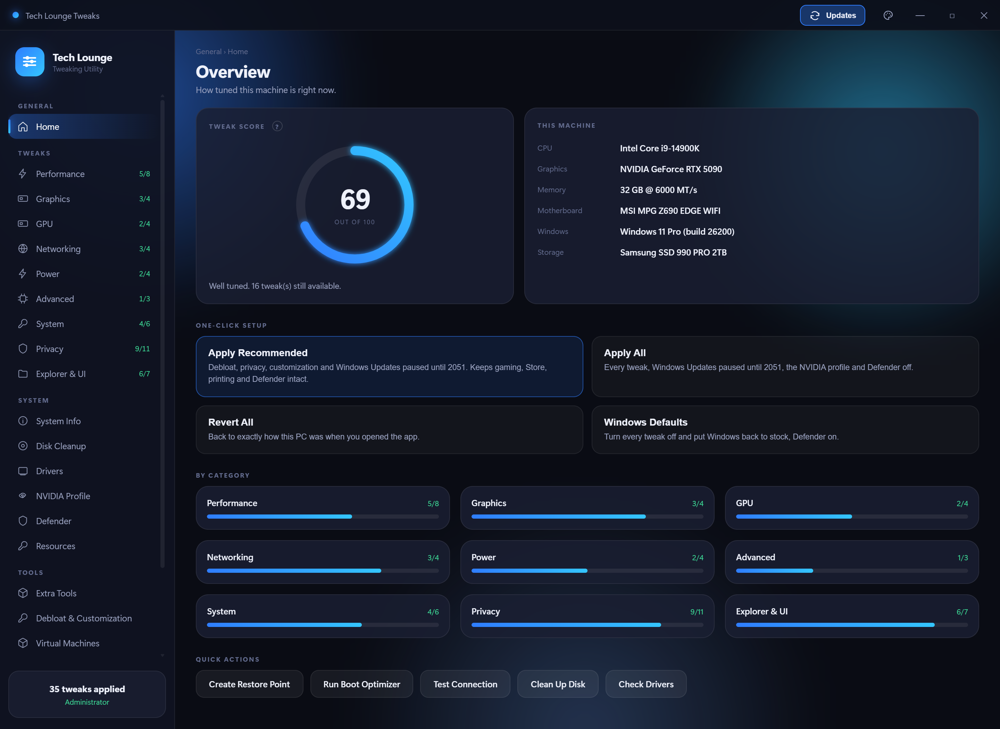
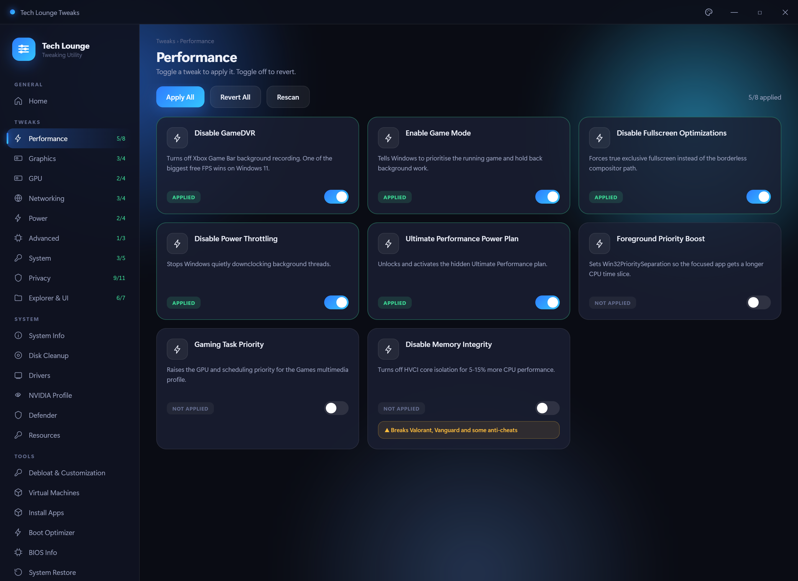
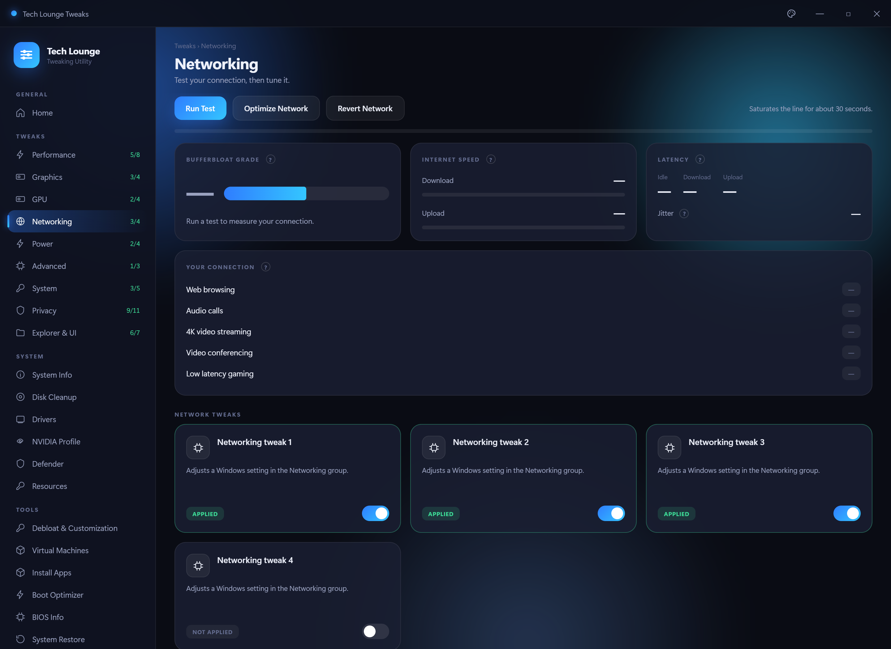
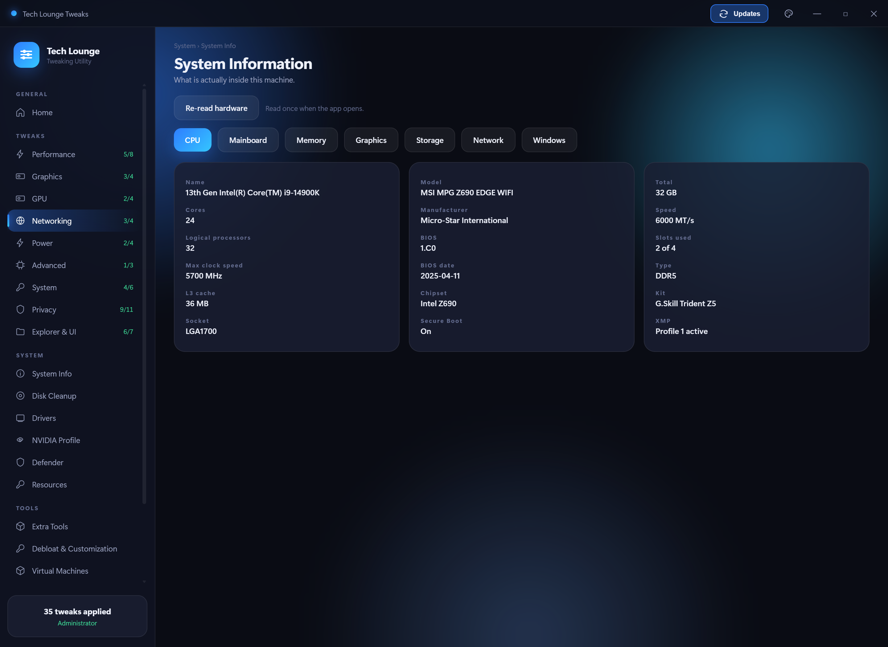

# Tech Lounge Tweaks

A Windows 11 tweaking utility built for The Tech Lounge. Toggle performance,
latency and privacy tweaks, test your connection for bufferbloat, clean up
junk files and check your GPU drivers — all from one window.

Every tweak reads the live system state, so the app shows you what is
**actually** set on your machine rather than assuming. Every toggle reverts.

---

## Download

**[⬇ Download TechLoungeTweaks.zip](https://github.com/RaheemC4/tech-tips/raw/main/TechLoungeTweaks/TechLoungeTweaks.zip)** (19 MB)

1. Download the zip
2. **Extract it** somewhere you keep programs — `C:\Tools\` is a good spot.
   Do not run it from inside the zip, and avoid leaving it in Downloads
   (Windows cleans that folder out and scans it hard)
3. Open the extracted folder and run **TechLoungeTweaks.exe**

Keep the whole folder together — the `_internal` folder next to the exe is
the app itself. Moving the exe out on its own will not work.

### Why a folder and not one .exe

An earlier version was a single self-extracting exe. It unpacked ~46 MB to
your temp folder on *every* launch, which made startup slow and unpredictable,
and the self-extracting behaviour is exactly what antivirus heuristics look
for — Defender was flagging it as a false positive. The folder build starts
almost instantly and does not trip those scanners.

### First run

Windows will show a blue **"Windows protected your PC"** box, because the app
is not code-signed (a signing certificate costs a few hundred pounds a year,
which is not worth it for a free tool).

> Click **More info** → **Run anyway**

#### "Smart App Control blocked an app that may be unsafe"

This is a **different** dialog — it only has **Okay** and **Get apps from the
Store**, with no way to run the app anyway. That is Smart App Control, not
SmartScreen, and it blocks every unsigned program with no per-app override.

Only clean Windows 11 installs have it switched on. To check:

> Windows Security → App & browser control → Smart App Control

If it says **On**, the only ways round it are to turn it off or not run the app.

⚠️ **Turning Smart App Control off is permanent.** Microsoft does not allow it
to be switched back on afterwards — the only way to re-enable it is a clean
reinstall of Windows. Do not turn it off casually, and never on someone else's
machine without telling them that first.

If it says **Evaluation** or **Off**, this dialog is not what is stopping you —
see the SmartScreen steps above.

**It needs to run as administrator** and will prompt for that automatically,
because most of these settings live in `HKEY_LOCAL_MACHINE`.

### Requirements

| | |
|---|---|
| **Windows 11** | Works out of the box |
| **Windows 10** | May need the [WebView2 runtime](https://developer.microsoft.com/microsoft-edge/webview2/) (free, from Microsoft) |

---

## Before you start

**Make a restore point.** There is a button for it under *Tools → System
Restore*. It takes about ten seconds and means any change here is reversible
even if something goes wrong.

Two tweaks will break games with kernel-level anti-cheat. They are marked
with a yellow warning in the app, but to be explicit:

- **Disable Memory Integrity** — Valorant (Vanguard) and FACEIT will refuse
  to launch.
- **Disable CPU Mitigations** — weakens Spectre/Meltdown protection.

Everything else is safe to try and safe to undo.

---

## What's in it

### Tweaks

Around 50 tweaks across nine categories. Each one shows whether it is
currently applied, and the toggle works both ways.

| Category | What it covers |
|---|---|
| **Performance** | GameDVR, Game Mode, fullscreen optimizations, power throttling, Ultimate Performance plan, CPU priority |
| **Graphics** | Hardware GPU scheduling, variable refresh rate, windowed optimizations, mouse acceleration |
| **GPU** | NVIDIA and AMD driver-level tweaks — only the ones for your card are shown |
| **Networking** | Nagle's algorithm, network throttling, offloads, firewall popups |
| **Power** | Dynamic tick, timer coalescing, USB selective suspend and power management |
| **Advanced** | Memory compression, page combining, CPU mitigations |
| **System** | Shutdown speed, menu delay, startup delay, SysMain, telemetry service |
| **Privacy** | Telemetry, activity history, advertising ID, error reporting, typing/speech/ink collection |
| **Explorer & UI** | Classic context menu, Bing in Start, snap layouts, lock screen, widgets, ads |

### Connection test

A proper bufferbloat test — it measures your idle ping, then measures it
again while saturating the line in each direction. The gap between the two is
what makes games feel laggy when someone else is streaming.

Reports download and upload speed, ping, **jitter**, and a plain-English
verdict on what your connection can handle. Hover any **?** for an
explanation of what the number means and what a good value looks like.

### System information

CPU, motherboard, memory (including whether XMP looks active), graphics,
storage health and network adapters. Read once when the app opens, so
switching tabs is instant.

### Tools

- **Boot Optimizer** — detects your CPU and GPU, then applies startup and
  shutdown tuning that suits them. Preview shows exactly what would change
  before you commit. Secure Boot, TPM and VBS are never touched, so kernel
  anti-cheat keeps working. Every change is written to a rollback file.
- **Disk Cleanup** — temp files, Windows Update cache, delivery optimization,
  crash dumps, thumbnails. Shows size per item, you pick what goes.
- **Drivers** — checks your installed NVIDIA driver against the latest
  release from NVIDIA's own lookup service.
- **Resources** — SFC, DISM and a read-only disk check, each with a clear
  verdict on whether anything was actually wrong.
- **BIOS Info** — firmware version, boot mode, Secure Boot, TPM,
  virtualization and memory speed.

---

## A note on BIOS tweaks

The BIOS page is **read-only by design**.

Dell, HP and Lenovo publish supported WMI interfaces for changing firmware
settings from Windows, and the app will use them where it finds one.
Consumer boards (ASUS, MSI, Gigabyte, ASRock) publish nothing equivalent —
the only route in is writing firmware NVRAM through an undocumented driver,
and a bad write bricks the board with no way back.

Change those settings in the firmware itself at POST.

---

## Undoing things

- Any individual tweak — toggle it off.
- A whole category — **Revert All** at the top of the page.
- Boot Optimizer — the **Undo** button restores from its rollback file.
- Everything, including things this app never touched — Windows System
  Restore, using the point you made before you started.

---

## Credits

Built for [The Tech Lounge](https://discord.gg/) Discord community.
Tweaks are drawn from the server's tech-tips archive plus documented Windows
settings.

Use at your own risk — read what a tweak does before applying it.
